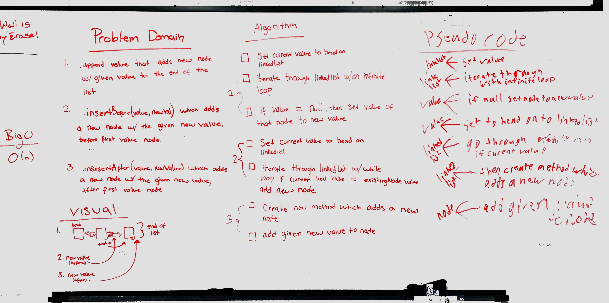
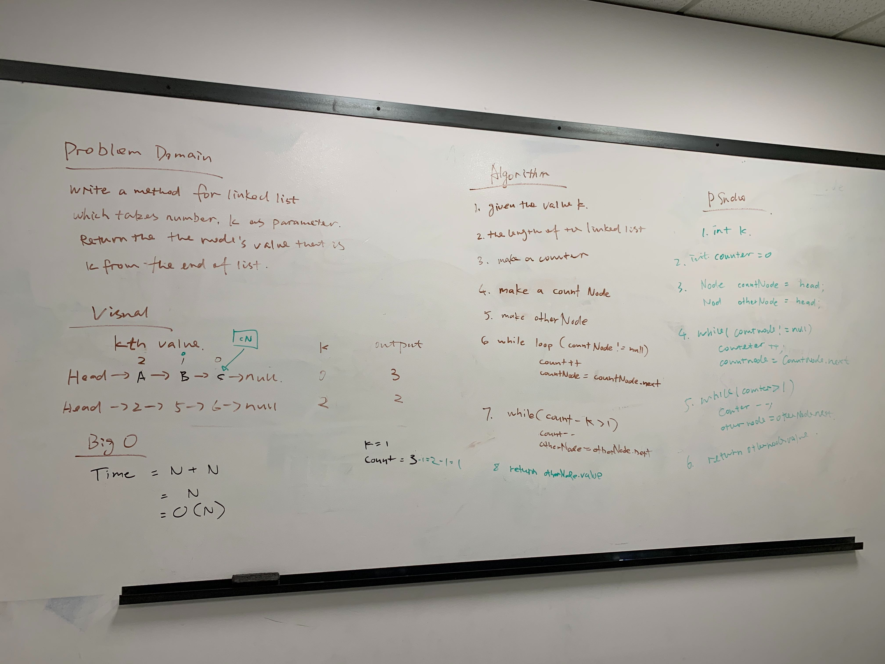
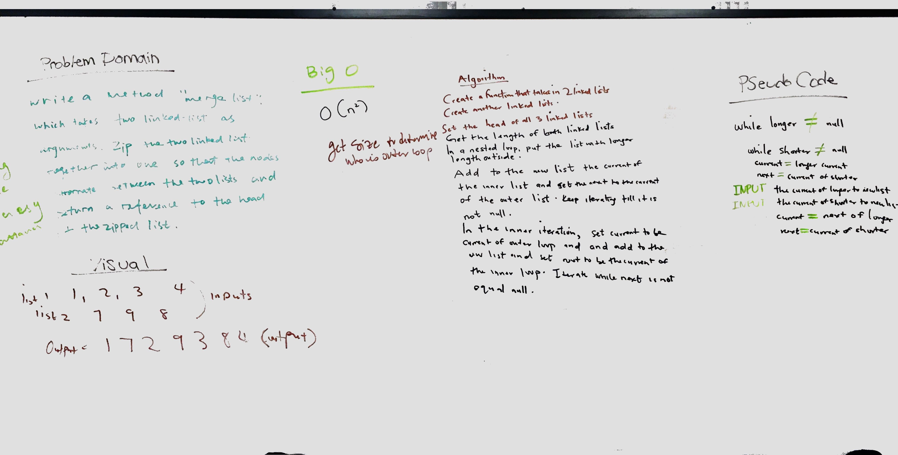

# data-structures-and-algorithms

## linked list
we need to build three method:
* Define a method called insert which takes any value as an argument and adds a new node with that value to the head of the list with an O(1) Time performance.
* Define a method called includes which takes any value as an argument and returns a boolean result depending on whether that value exists as a Node’s value somewhere within the list.
* Define a method called toString (or __str__ in Python) which takes in no arguments and returns a string representing all the values in the Linked List, formatted as:
"{ a } -> { b } -> { c } -> NULL"
## Challenge
1. I am still get used to using the correct syntax for java,
2. I had hard time to write the correct test 

## Approach & Efficiency
I did a lot of search online and watch the youtube video to figure out how to write the test for my code 

## code challenge 01

### Challenge Summary
<!-- Short summary or background information -->

### Challenge Description
<!-- Description of the challenge -->

### Approach & Efficiency
<!-- What approach did you take? Why? What is the Big O space/time for this approach? -->

### Solution
<!-- Embedded whiteboard image -->

## code challenge 02

### Challenge Summary
<!-- Short summary or background information -->

### Challenge Description
<!-- Description of the challenge -->

### Approach & Efficiency
<!-- What approach did you take? Why? What is the Big O space/time for this approach? -->

### Solution
<!-- Embedded whiteboard image -->

## code challenge 03

### Challenge Summary
<!-- Short summary or background information -->

### Challenge Description
<!-- Description of the challenge -->

### Approach & Efficiency
<!-- What approach did you take? Why? What is the Big O space/time for this approach? -->

### Solution
<!-- Embedded whiteboard image -->

## code challenge 04

### Challenge Summary
<!-- Short summary or background information -->

### Challenge Description
<!-- Description of the challenge -->

### Approach & Efficiency
<!-- What approach did you take? Why? What is the Big O space/time for this approach? -->

### Solution
<!-- Embedded whiteboard image -->

## code challenge 05

### Challenge Summary
<!-- Short summary or background information -->

### Challenge Description
<!-- Description of the challenge -->

### Approach & Efficiency
<!-- What approach did you take? Why? What is the Big O space/time for this approach? -->

### Solution
<!-- Embedded whiteboard image -->

## code challenge 06 

### Challenge Summary
<!-- Short summary or background information -->

### Challenge Description
<!-- Description of the challenge -->

### Approach & Efficiency
<!-- What approach did you take? Why? What is the Big O space/time for this approach? -->

### Solution
<!-- Embedded whiteboard image -->

## code challenge 07 

### Challenge Summary
Write a method for the Linked List class which takes a number, k, as a parameter. Return the node’s value that is k from the end of the linked list.

### Challenge Description
The challenge part to me is how to track the kth number 
### Approach & Efficiency
we created a count node and other node also a counter to track kth number. 

### Solution

## code challenge 08

### Challenge Summary
Write a function called mergeLists which takes two linked lists as arguments. Zip the two linked lists together into one so that the nodes alternate between the two lists and return a reference to the head of the zipped list. 
### Challenge Description
It was hard to figure out how to put nodes zip two list so that the nodes alternate between the two lists and return a reference to the head of the new list
### Approach & Efficiency
First we need to create a function to take two two list and know the size of two list; then we tried while loop to loop first list, inside the while loop create another while loop to loop the second list and add the value to the new list

### Solution
