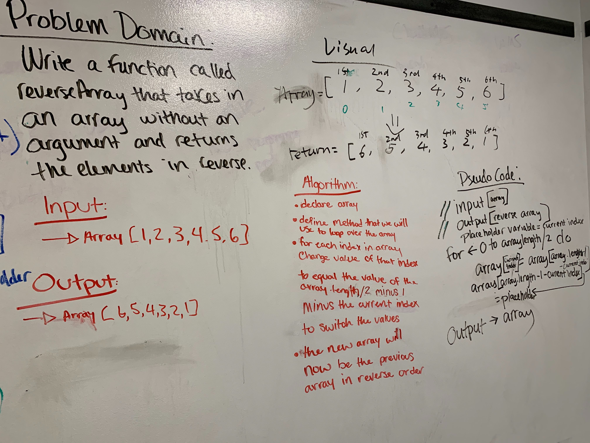

# data-structures-and-algorithms

## linked list
we need to build three method:
* Define a method called insert which takes any value as an argument and adds a new node with that value to the head of the list with an O(1) Time performance.
* Define a method called includes which takes any value as an argument and returns a boolean result depending on whether that value exists as a Node’s value somewhere within the list.
* Define a method called toString (or __str__ in Python) which takes in no arguments and returns a string representing all the values in the Linked List, formatted as:
"{ a } -> { b } -> { c } -> NULL"
## Challenge
1. I am still get used to using the correct syntax for java,
2. I had hard time to write the correct test 

## Approach & Efficiency
I did a lot of search online and watch the youtube video to figure out how to write the test for my code 

## code challenge 01

## code challenge 02

## code challenge 03

## code challenge 04

## code challenge 05

## code challenge 06 

## code challenge 07 
